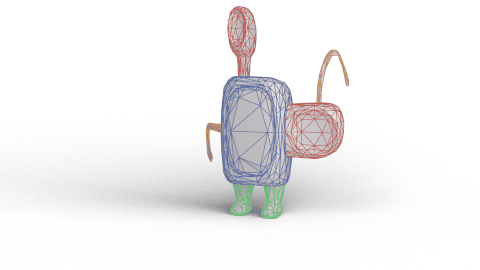

<br><br><br>

# MeshCNN in PyTorch


### SIGGRAPH 2019 [[Paper]](https://bit.ly/meshcnn) [[Project Page]](https://ranahanocka.github.io/MeshCNN/)<br>

MeshCNN is a general-purpose deep neural network for 3D triangular meshes, which can be used for tasks such as 3D shape classification or segmentation. This framework includes convolution, pooling and unpooling layers which are applied directly on the mesh edges.

# More Info
Check out the [MeshCNN wiki](https://github.com/ranahanocka/MeshCNN/wiki) for more details. Specifically, see info on [segmentation](https://github.com/ranahanocka/MeshCNN/wiki/Segmentation) and [data processing](https://github.com/ranahanocka/MeshCNN/wiki/Data-Processing).

# Citation
If you find this code useful, please consider citing our paper
```
@article{hanocka2019meshcnn,
  title={MeshCNN: A Network with an Edge},
  author={Hanocka, Rana and Hertz, Amir and Fish, Noa and Giryes, Raja and Fleishman, Shachar and Cohen-Or, Daniel},
  journal={ACM Transactions on Graphics (TOG)},
  volume={38},
  number={4},
  pages = {90:1--90:12},
  year={2019},
  publisher={ACM}
}
```

